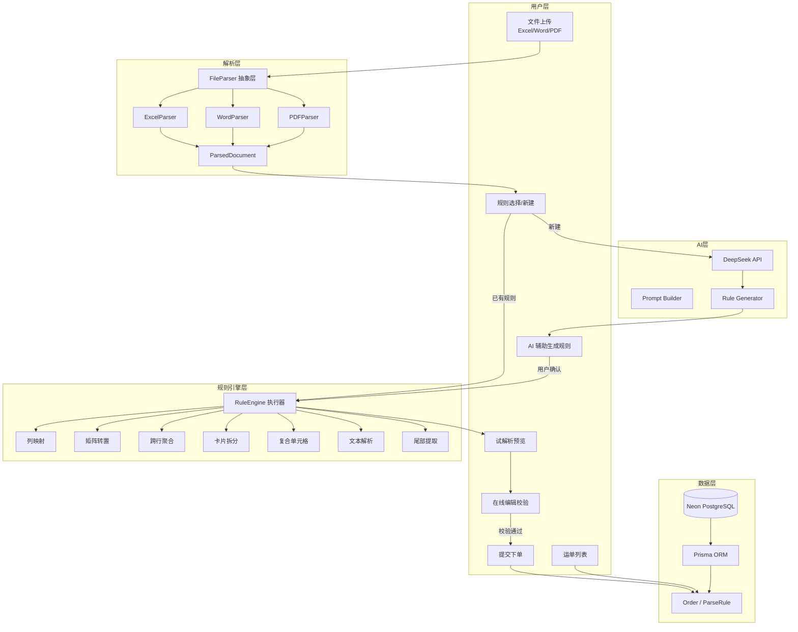

## 用户需求

在现有 V1 Excel 导入系统基础上，全面升级为 V2"万能导入"系统，满足《AI 考试题目：万能导入 V2》全部要求。

## 产品概述

智能多格式批量下单系统：用户上传任意格式（Excel/Word/PDF）的出库单文件，系统通过可配置的规则引擎 + AI 辅助生成解析规则，自动解析为结构化下单数据，经在线预览编辑、校验后批量提交入库。支持 9 种复杂出库单格式全覆盖，零硬编码适配新格式。

## 核心功能

- **多格式文件导入**：支持上传 Excel (.xlsx/.xls)、Word (.docx)、PDF 文件，拖拽或点击上传，移除 1MB 限制
- **规则引擎系统**：通用 JSON 配置驱动的解析规则，支持头部跳过、尾部信息提取、跨行聚合、矩阵转置、卡片边界识别、多Sheet合并、复合单元格拆分、纯文本解析等复杂场景，规则 CRUD、复制、持久化存储
- **AI 辅助规则生成**：上传文件后调用 DeepSeek API 分析文件结构，自动生成推荐解析规则，标注置信度，用户手动微调确认后保存，支持试解析预览
- **数据预览与在线编辑**：类 Excel 可编辑表格，表头固定、横向滚动、单元格点击编辑（Tab/Enter 导航）、实时校验（必填缺失标红、格式错误标红）、全量错误一次性展示（标注行号+字段名+原因）、外部编码重复检测、删除行/新增行
- **提交下单**：分批写入数据库、实时进度条、结果汇总（成功N条/失败N条）、有错误禁止提交
- **运单列表**：历史记录分页查看，按外部编码/收件人姓名/提交时间筛选搜索
- **鲸天风格 UI**：主色 #0fc6c2、浅色背景、圆角卡片、清爽蓝绿色调、Loading/Toast/过渡动画完善
- **高性能**：1000 条数据 10 秒内完成解析+渲染，前端虚拟列表优化大列表展示

## 技术栈

- **前端框架**：Next.js 14 App Router + React 18 + TypeScript
- **样式方案**：Tailwind CSS（浅色主题，主色 #0fc6c2）
- **数据库**：Neon PostgreSQL + Prisma ORM（保持现有）
- **Excel 解析**：xlsx (SheetJS)（现有，扩展多Sheet和矩阵处理）
- **Word 解析**：mammoth.js（提取文本结构）
- **PDF 解析**：pdf-parse（提取文本和表格）
- **AI 集成**：DeepSeek Chat API（生成解析规则 JSON）
- **校验**：zod（现有，扩展V2字段校验）
- **虚拟列表**：@tanstack/react-virtual
- **通知**：sonner（现有）

## 实现方案

### 核心架构决策

**规则引擎架构**：采用 JSON 配置驱动 + TypeScript 规则执行器的混合模式。解析规则以结构化 JSON 存储于数据库，规则执行器在客户端运行（支持预览即时反馈），同时服务端也具备执行能力（用于异步批量处理）。规则描述覆盖：数据区域识别（跳过行/表头行/尾部行）、列映射、变换类型（矩阵转置/跨行聚合/卡片拆分/复合单元格拆分/文本解析）、尾部信息提取、静态默认值。

**多格式统一抽象**：设计 `FileParser` 抽象层，Excel/Word/PDF 各实现 `parse()` 方法，统一返回 `ParsedDocument` 结构（包含 sheets/tables/textBlocks），规则引擎基于此抽象输出执行解析，与具体文件格式解耦。

**AI 集成策略**：文件解析为文本表示后，构建包含文件结构描述 + 系统字段定义的 Prompt，调用 DeepSeek API 返回规则 JSON。AI 仅生成规则（非直接解析数据），用户必须在试解析预览中确认后方可保存生效。API Key 通过环境变量 `DEEPSEEK_API_KEY` 配置，具有超时控制和错误降级。

**性能优化**：前端使用 Web Worker 离线解析大文件不阻塞主线程；规则执行采用流式批量处理；预览表格使用 @tanstack/react-virtual 虚拟列表，1000 行渲染在 3 秒内完成。

### 实施细节

1. **规则执行器**：纯函数设计，无副作用，输入 `ParsedDocument + ParseRuleConfig`，输出 `OrderRowDraft[]`。每个变换类型独立实现，组合使用。
2. **错误处理**：解析失败保留原始文件内容，提供手动配置规则入口；AI 调用失败降级为手动配置模式；所有 API 路由统一错误格式。
3. **数据模型变更**：Order 模型扩展 V2 字段（收货门店 receiverStore、SKU 字段群），新增 ParseRule 模型替换 TemplateMapping。
4. **向后兼容**：保留 V1 的简单导入路径，通过规则引擎中的 `transform: "none"` 配置实现兼容。

## 架构设计



## 目录结构

```
d:/AI_Code/Cursor_code/AI_Excel_V2/
├── prisma/
│   └── schema.prisma              # [MODIFY] 新增 ParseRule 模型，Order 模型扩展 V2 字段（receiverStore, skuCode, skuName, skuQty, skuSpec）
├── lib/
│   ├── db.ts                      # [MODIFY] Prisma 客户端（保持现有，新增类型导出）
│   ├── order-types.ts             # [MODIFY] 扩展 V2 字段定义：收货门店、SKU编码/名称/数量/规格，A组/B组二选一校验
│   ├── rule-types.ts              # [NEW] 解析规则类型定义：ParseRuleConfig、transform 枚举、footer/region/card 配置接口
│   ├── rule-engine.ts             # [NEW] 规则引擎执行器：executeRule() 核心函数，调度各变换处理器
│   ├── rule-transforms.ts         # [NEW] 变换处理器集合：matrixTranspose/crossRowAggregate/cardSplit/compositeCellSplit/textParse/footerExtract
│   ├── file-parser.ts             # [NEW] 多格式解析器抽象层：parseFile() 统一入口，路由到 Excel/Word/PDF 解析器
│   ├── excel-parser.ts            # [NEW] Excel 解析器（重构自 excel-utils.ts）：多Sheet、矩阵模式、卡片模式
│   ├── word-parser.ts             # [NEW] Word 解析器：mammoth 提取文本 → 结构化段落/表格
│   ├── pdf-parser.ts              # [NEW] PDF 解析器：pdf-parse 提取文本 → 表格检测 + 文本块
│   ├── excel-utils.ts             # [MODIFY] 保留导出和基础工具函数，解析核心迁移至 excel-parser.ts
│   ├── column-mapping.ts          # [MODIFY] 扩展同义词表覆盖 V2 新字段，作为规则引擎列映射的降级方案
│   ├── order-rows.ts              # [MODIFY] 扩展 buildDraftRowsFromRule()，支持规则引擎输出的行构建
│   ├── ai-rule-generator.ts       # [NEW] AI 规则生成服务：buildPrompt() + callDeepSeek() + parseRuleResponse()，超时30s
│   └── header-signature-server.ts # [MODIFY] 适配规则引擎，计算规则签名用于去重
├── components/
│   ├── FileDropzone.tsx           # [MODIFY] 扩展支持 .docx/.pdf，移除 1MB 限制，大文件警告提示
│   ├── RuleSelector.tsx           # [NEW] 规则选择面板：已有规则列表（搜索/分页）、新建规则按钮、规则详情预览
│   ├── RuleEditor.tsx             # [NEW] 规则编辑器：可视化配置解析规则（区域设置/列映射/变换类型/尾部提取），AI 推荐标注置信度
│   ├── RuleTestPreview.tsx        # [NEW] 试解析预览：当前文件 + 当前规则 → 实时展示解析结果，确认/修改/保存
│   ├── AIPanel.tsx                # [NEW] AI 辅助面板：分析文件、生成规则、展示置信度、支持逐字段确认
│   ├── ImportFlow.tsx             # [MODIFY] 重构导入流程：upload → rule-select → rule-edit/AI → parse-preview → grid-edit → submit
│   ├── OrdersGrid.tsx             # [MODIFY] 集成 @tanstack/react-virtual 虚拟列表，扩展 V2 列显示
│   ├── ProgressBar.tsx            # [MODIFY] 保持现有，增加解析阶段标签
│   ├── ShipmentsTable.tsx         # [MODIFY] 扩展 V2 字段列，适配新 Order 模型
│   └── ColumnMapper.tsx           # [DELETE] 被 RuleEditor 取代
├── app/
│   ├── globals.css                # [MODIFY] 全面改造为鲸天浅色主题：主色 #0fc6c2，圆角卡片，清爽蓝绿
│   ├── layout.tsx                 # [MODIFY] 导航栏改造为鲸天风格，Logo + 导航链接更新
│   ├── page.tsx                   # [MODIFY] 首页改造，功能卡片 + 流程引导
│   ├── import/
│   │   └── page.tsx               # [MODIFY] 渲染升级后的 ImportFlow
│   ├── rules/
│   │   └── page.tsx               # [NEW] 规则管理独立页面：规则列表/编辑/复制/删除
│   ├── shipments/
│   │   └── page.tsx               # [MODIFY] 适配新 Order 字段
│   └── api/
│       ├── orders/
│       │   ├── route.ts           # [MODIFY] 查询接口适配新字段
│       │   ├── check-externals/
│       │   │   └── route.ts      # [MODIFY] 保持，适配 SKU 编码查重
│       │   └── submit/
│       │       └── route.ts      # [MODIFY] 提交接口适配 V2 字段
│       ├── rules/
│       │   ├── route.ts           # [NEW] 规则 CRUD API（GET 列表/POST 创建）
│       │   └── [id]/
│       │       └── route.ts       # [NEW] 规则单条 API（GET/PUT/DELETE）
│       ├── ai/
│       │   └── generate-rule/
│       │       └── route.ts       # [NEW] AI 规则生成 API：接收文件内容 → 调用 DeepSeek → 返回推荐规则 JSON
│       └── template-mapping/      # [DELETE] 被 /api/rules 取代
├── tailwind.config.ts             # [MODIFY] 浅色主题配色：主色 #0fc6c2，扩展蓝绿色系
├── package.json                   # [MODIFY] 新增依赖：mammoth/pdf-parse/@tanstack/react-virtual
└── .env                           # [MODIFY] 新增 DEEPSEEK_API_KEY 环境变量
```

## 关键代码结构

```typescript
// lib/rule-types.ts - 规则引擎核心类型
export interface ParseRuleConfig {
  id: string;
  name: string;
  fileFormat: "xlsx" | "xls" | "docx" | "pdf";
  
  region: {
    sheetFilter?: string;
    headerSkipRows: number;
    headerRow: number;
    footerSkipRows?: number;
    dataStartRow?: number;
    dataEndRow?: number;
    mergeSheets?: boolean;
    cardDetection?: { startMarker: string; endMarker?: string; fieldsBeforeTable?: Record<string, number> };
  };
  
  columns: Record<string, string>;  // systemField → sourceColumnName
  
  transform: {
    type: "none" | "matrix_transpose" | "cross_row_aggregate" | "card_split" | "composite_cell_split" | "text_parse";
    config?: Record<string, unknown>;
  };
  
  footer?: Array<{ field: string; pattern: string; offset?: number }>;
  defaults?: Record<string, string>;
  
  aiMetadata?: { generated: boolean; model: string; confidence: Record<string, "high"|"medium"|"low"> };
}

// lib/rule-engine.ts - 规则执行器核心接口
export interface RuleEngineResult {
  rows: OrderRowDraft[];
  warnings: string[];
  stats: { totalRows: number; skippedRows: number; footerExtracted: boolean };
}
export function executeRule(document: ParsedDocument, rule: ParseRuleConfig): RuleEngineResult;
```

## 设计风格

采用**鲸天系统**设计语言，以主色 `#0fc6c2`（青绿色）为核心品牌色，整体呈现清爽、现代、专业的企业级 SaaS 风格。浅色背景为主，圆角卡片布局，合理的留白与视觉层次，配合微交互动画提升操作体验。

## 页面设计

### 1. 首页

- **顶部导航栏**：白色背景，Logo 左侧 + 导航链接（导入下单、运单列表、规则管理），当前页高亮下划线 #0fc6c2
- **Hero 区域**：渐变背景（#e8fafa → #ffffff），大标题"万能导入 — 智能批量下单"，副标题描述，CTA 按钮"开始导入"（#0fc6c2 圆角）
- **功能卡片区**：4 张卡片横向排列（多格式支持、AI 智能解析、在线编辑、批量下单），每张卡片含图标 + 标题 + 描述文字，hover 上浮动画

### 2. 导入页面（核心流程）

- **步骤指示器**：顶部横条步骤条（上传 → 选择规则 → AI生成/编辑规则 → 预览 → 提交），当前步骤高亮 #0fc6c2，已完成步骤打勾
- **上传区域**：虚线边框拖拽区，中间图标+文字"拖拽文件到此处，或点击上传"，支持格式标签（Excel/Word/PDF），上传后显示文件名+大小
- **规则选择面板**：卡片列表展示已有规则（规则名+格式+更新时间），搜索框筛选，每张卡片可点击选择或预览详情，"新建规则"按钮突出展示
- **AI 辅助面板**：进度条动画（AI分析中...），结果展示为规则编辑器，每个字段标注置信度（高=绿色勾/中=黄色警告/低=红色问号），用户可逐项修改
- **试解析预览**：右侧实时表格，规则修改即时反映解析结果，突出显示解析异常行
- **在线编辑表格**：表头固定（浅灰底色），数据行斑马纹，编辑单元格蓝色边框，错误单元格红色边框+tooltip，虚拟列表流畅滚动

### 3. 规则管理页面

- 表格式列表：规则名称、适用格式、创建时间、操作（编辑/复制/删除），分页，搜索
- 编辑弹窗：全屏 Drawer 或独立页面，可视化配置表单（区域设置、列映射拖拽、变换类型下拉、尾部提取正则）

### 4. 运单列表页面

- 表格式数据展示，支持筛选（外部编码、收件人姓名、时间范围），分页，空状态占位图

## 交互细节

- 按钮悬停微放大 + 阴影加深，点击有波纹效果
- Toast 通知（sonner）右上角弹出，成功绿色/失败红色/信息蓝色
- Loading 状态用骨架屏或 spinner，避免空白等待
- 表格横向滚动时左侧固定列（序号），表头始终可见
- 响应式：小屏幕堆叠布局，表格横向可滚动

## 技能扩展

### Skill

- **xlsx**
- 用途：解析和操作 Excel 测试文件（demo 文件），提取原始数据用于验证规则引擎正确性
- 预期结果：从 6 份 Excel demo 文件中读取完整数据结构（行数、列数、表头、特殊格式），用于编写规则配置

- **pdf**
- 用途：解析 PDF 格式的 demo 文件（黔寨寨配送单），提取文本内容和表格结构
- 预期结果：获取 PDF 的完整文本表示和表格数据，验证 PDF 解析器实现正确性

- **docx**
- 用途：解析 Word 格式的 demo 文件（门店配送确认单），提取段落和文本内容
- 预期结果：获取 Word 文档的结构化文本，用于设计纯文本解析规则

- **logistics-parser**
- 用途：从 demo 文件提取的 OCR 文本中进行物流信息结构化提取，辅助验证字段映射准确性
- 预期结果：验证收货人/发货人/货物信息的提取逻辑是否与规则引擎设计一致

- **ui-ux-pro-max**
- 用途：设计鲸天风格 UI 组件和页面，确保主色 #0fc6c2、圆角卡片、浅色主题与考试要求一致
- 预期结果：生成符合鲸天系统设计规范的前端组件代码和样式方案

### SubAgent

- **code-explorer**
- 用途：深度探索现有项目代码结构、所有组件的依赖关系和 API 调用链
- 预期结果：完整掌握现有代码架构，确保升级方案不破坏已有功能，准确定位修改点